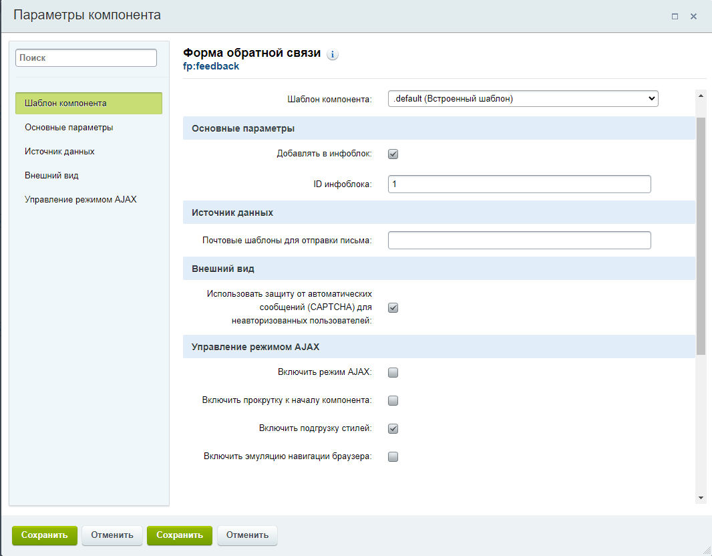

Bitrix компонент предназначенный для отправки результатов формы на почту по id почтового шаблона, а так же с возможностью сохранения результатов в инфоблок

Добавляем в /(local/bitrix)/components/(ваше пространство имен либо fp)/

В настройках инфоблока код свойства должен соответствовать названию поля (атрибуту name)

Так же в инфоблок можно добавить свойство URL для информации о том, с какой страницы была отправлена форма 
